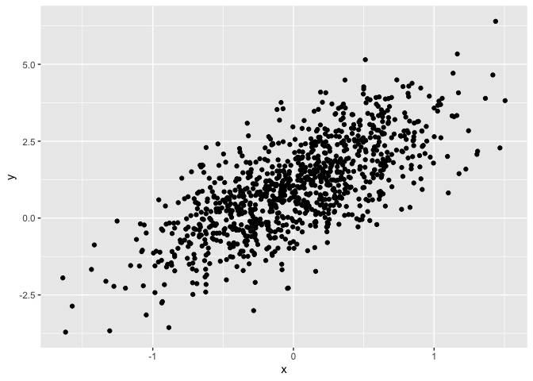
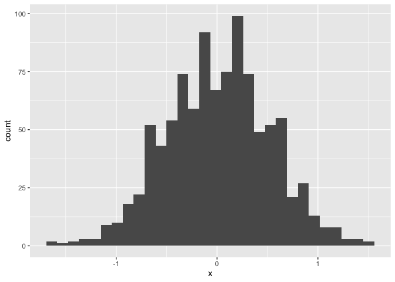

A really not so simple document
================
Alexa Burko

I’m an R Markdown document!

toc: true creates a table of contents

# Section 0: Libraries

Echo=F means that that, when knitted, the document will not include the
code itself, but will include the output

Message = F means any warnings or messages will not show in the document

eval = F means that that chunk of code will not run

# Section 1

Here’s a **code chunk** that samples from a *normal distribution*:

``` r
samp = rnorm(100)
length(samp)
```

    ## [1] 100

# Section 2

I can take the mean of the sample, too! The mean is 0.0784904.

1 tick and then r will also be interpreted as code

**word** makes the words bolded *word* makes the words italicized

# Section 3: a tibble

``` r
plot_df = 
  tibble(
    x = rnorm(1000, sd = 0.5),
  y = 1 + 2 * x + rnorm(1000)
)

head(plot_df)
```

    ## # A tibble: 6 × 2
    ##         x     y
    ##     <dbl> <dbl>
    ## 1  0.456  2.07 
    ## 2 -0.686  0.494
    ## 3  0.140  2.21 
    ## 4  0.0761 3.17 
    ## 5 -0.455  0.605
    ## 6  0.360  1.26

# Section 4: plots

These are plots from our random sample
<!-- --><!-- -->
\# Section 5: Learning Assessment 2 Write a named code chunk that
creates a dataframe comprised of: a numeric variable containing a random
sample of size 500 from a normal variable with mean 1; a logical vector
indicating whether each sampled value is greater than zero; and a
numeric vector containing the absolute value of each element. Then,
produce a histogram of the absolute value variable just created. Add an
inline summary giving the median value rounded to two decimal places.
What happens if you set eval = FALSE to the code chunk? What about echo
= FALSE

Tibble creates a dataframe

Putting anything right after the r at the beginning of the chunk will be
the name of that chunk

The plot shows the distribution of the absolute value of $X$

``` r
set.seed(0)

df = tibble(
  num_var = rnorm(n=500, mean=1),
  log_var = num_var > 0,
  abs_var = abs(num_var))

ggplot(df, aes(x=abs_var)) + geom_histogram()
```

    ## `stat_bin()` using `bins = 30`. Pick better value `binwidth`.

<!-- --> The median is 0.94

The median is 0.94

The 2 is rounding the answer to 2 decimal places

The above two pieces of code do the same thing

# Section 6: Formatting

## Text formatting

*italic* or *italic* **bold** or **bold** `code` superscript<sup>2</sup>
and subscript<sub>2</sub>

## Headings

# 1st Level Header

## 2nd Level Header

### 3rd Level Header

## Lists

- Bulleted list item 1

- Item 2

  - Item 2a

  - Item 2b

1.  Numbered list item 1

2.  Item 2. The numbers are incremented automatically in the output.

## Tables

| First Header | Second Header |
|--------------|---------------|
| Content Cell | Content Cell  |
| Content Cell | Content Cell  |

# Section 7: Learning Assessment 3

After the previous code chunk, write a bullet list given the mean,
median, and standard deviation of the original random sample

The median is 0.94. The mean is 1. The standard deviation is 0.99.

What if i try to add a histogram

``` r
ggplot(plot_df, aes(x=x)) + geom_histogram()
```

    ## `stat_bin()` using `bins = 30`. Pick better value `binwidth`.

<!-- -->
